# Портфолио #
1. Разработка пользовательского интерфейса системы контроля и управления доступом СКУД. 
**Исходный код приложен в папке SCUD** 
Внутренний сервис компании, система создана для отображения входа-выхода сотрудников и ведения отчётности 
    * Список сотрудников
    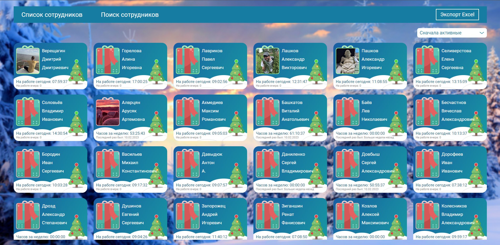
    * Поиск сотрудников
    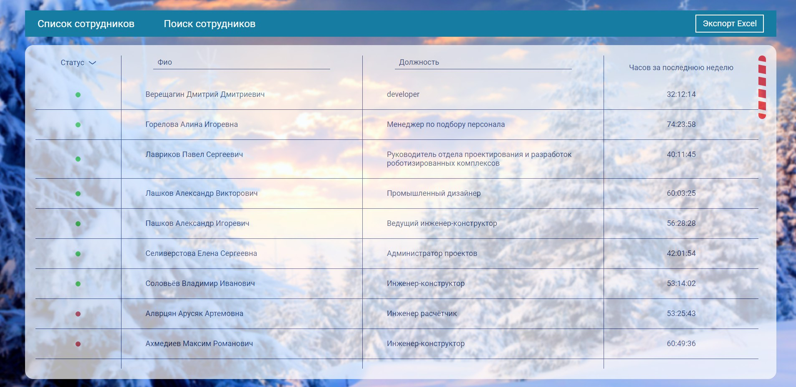
Реализован поск по ФИО и должности, раличные сортировки.
---
2. Разработка пользовательского интерфейса сервиса беспилотной доставки грузов беспилотными воздушными средствами. 
Данный интерфейс состоит из 3 экранов: 
    * Доставки - на этом экране отображаются активны, запланированные и выполненные заказы 
    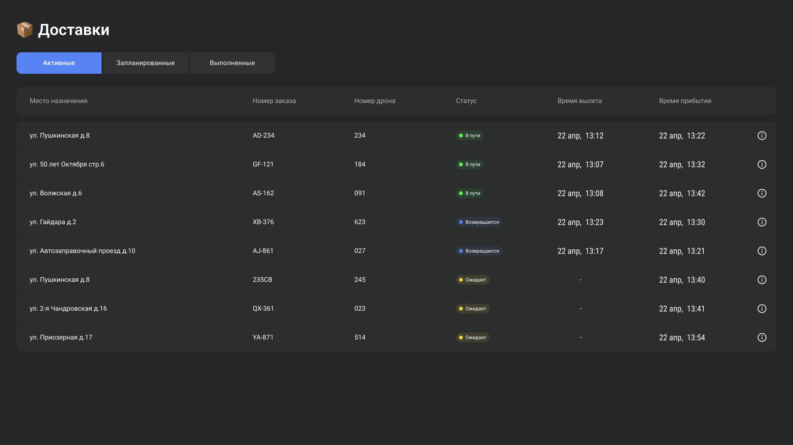
    * Карта -на этом экране отображаются список БВС с их полётными заданиями на карте 
    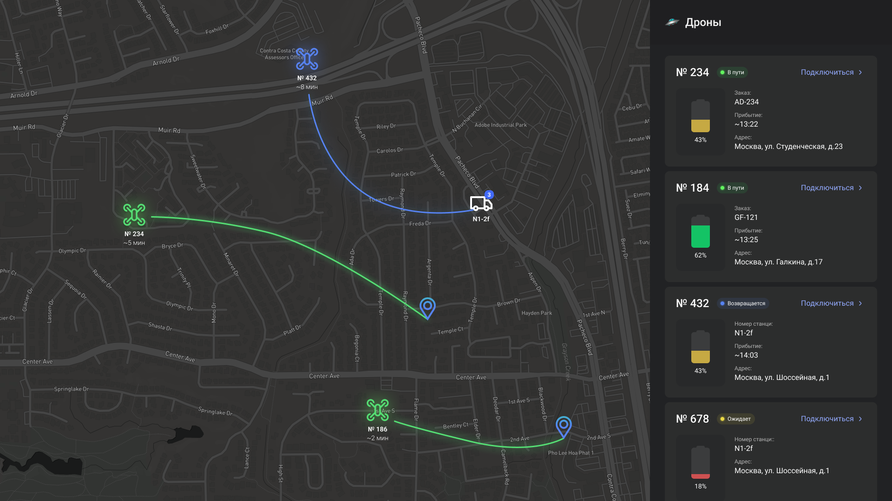
    * Телеметрия -на этом экране отображается показания приборов выбранного дрона 
    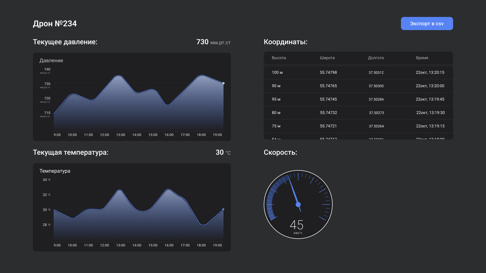
Данные о БВС и заказах получаются с сервера, при остановке полётного задания или начале полётного задания данные отправляются на сервер. 
Карта подключенна при помощи библиотеки OpenLayers.
---
3. Разработка пользовательского интерфейса системы учёта закупок. 
Внутренний сервис компании, система создана для хранения и добавления документов о закупках. 
Данные получаются с сервера. При редактировании и создании нового документа данные отправляются на сервер. 
    * Выбранный документ
    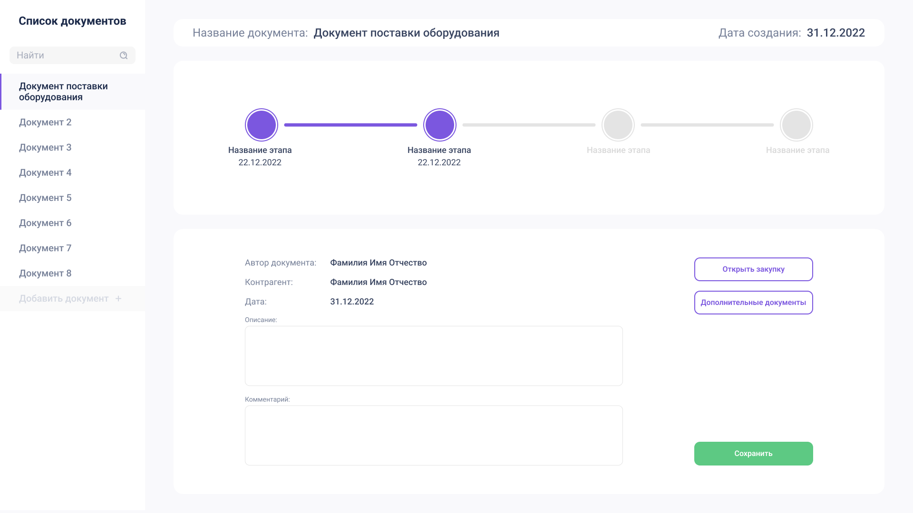
    * Список закупок
    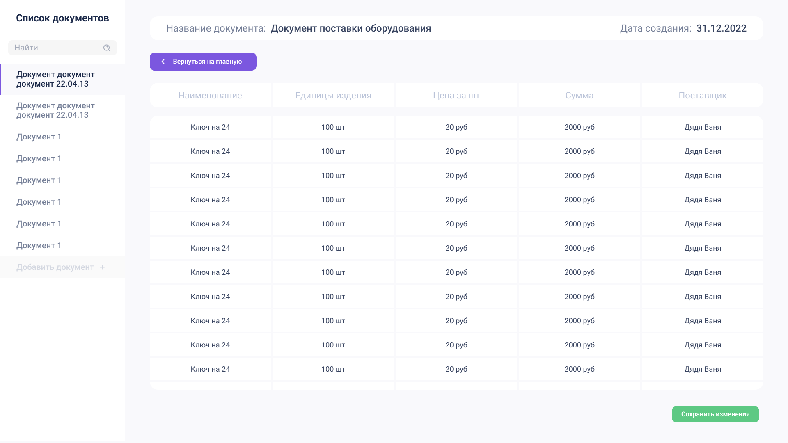
    * Список документов
    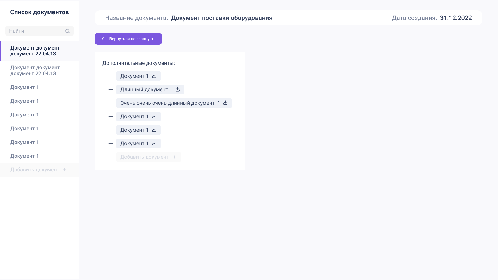
---
4. Разработка пользовательского интерфейса системы управления манипуляторами. 
Desktop приложения для контроля органов управления манипуляторов. 
Написанно при помощи QT и QML Для платы Raspberry Pi. 
Реализованно три вида управления
    * Управление по осям
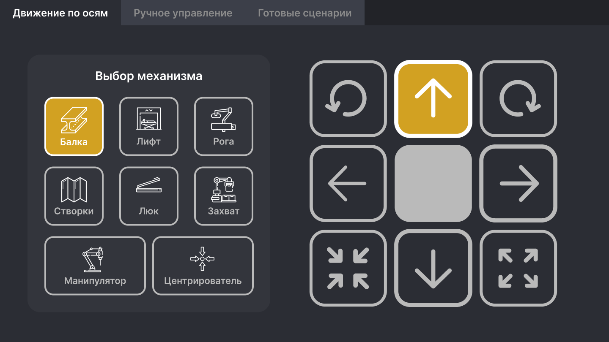
    * Ручное управление
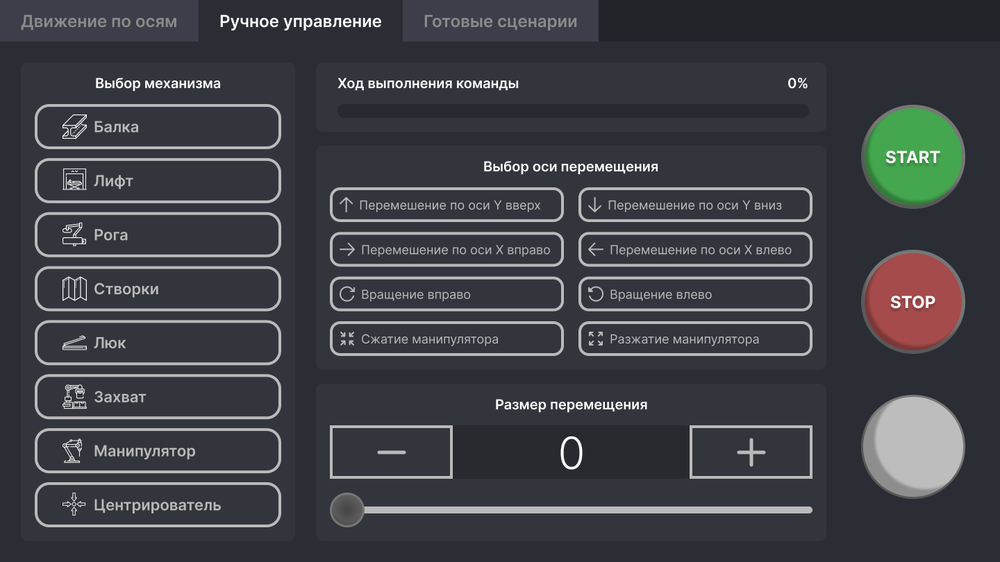
    * Готовые сценарии
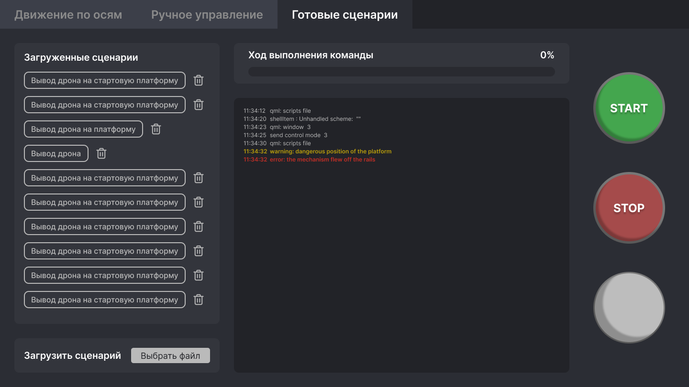
